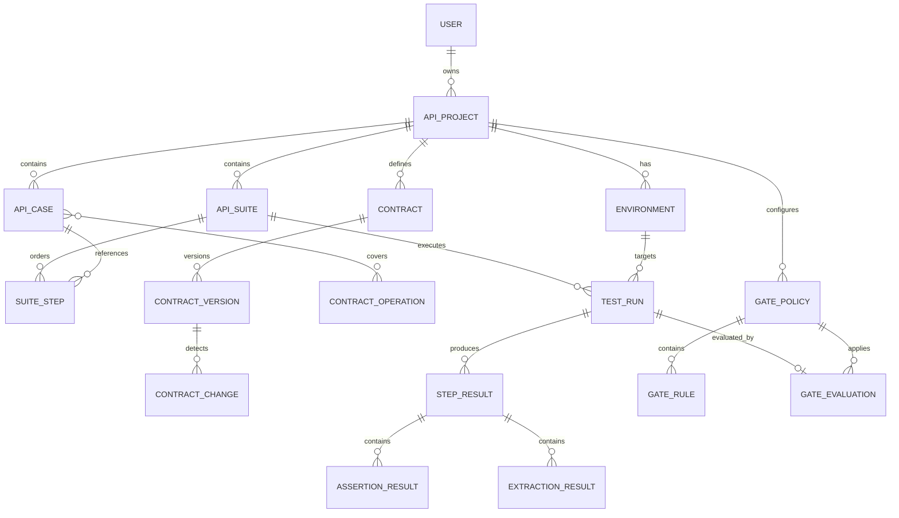

# TestHub QualityGate 数据模型

## 1. 设计原则

- 配置与执行快照分离：用例被修改后，历史执行仍可复现。
- 套件运行共享上下文：支持登录后提取 token 并供后续步骤使用。
- 证据结构化：每个断言、提取和错误均可定位到步骤。
- 契约可版本化：保存原始文档摘要、规范化内容与差异。
- 门禁结果不可含糊：策略、输入指标和判定证据一并落库。

## 2. 核心实体关系



## 3. 表定义（目标态）

### 3.1 沿用并演进

| 实体 | 关键字段 | 说明 |
|---|---|---|
| `ApiProject` | `id`, `name`, `owner_id` | 沿用现有接口测试项目 |
| `Environment` | `id`, `project_id`, `base_url`, `variables_ciphertext` | 将普通变量与密钥分离，密钥加密 |
| `ApiRequest` / `ApiCase` | `id`, `method`, `path`, `headers`, `params`, `body`, `timeout_ms` | 用例配置；不保存运行时响应 |
| `TestSuite` / `ApiSuite` | `id`, `project_id`, `environment_id`, `failure_strategy` | 套件级执行策略 |
| `TestSuiteRequest` / `SuiteStep` | `suite_id`, `case_id`, `order`, `enabled`, `overrides` | 明确步骤顺序与局部覆盖 |

命名迁移采用兼容策略：首期保留原表名，通过 service 暴露统一领域名称，避免高风险一次性改表。

### 3.2 执行域

#### `TestRun`

| 字段 | 类型 | 约束/含义 |
|---|---|---|
| `id` | UUID | 主键，对外执行 ID |
| `suite_id` | FK | 被执行套件 |
| `environment_id` | FK nullable | 目标环境 |
| `trigger_type` | enum | manual / schedule / ci / api |
| `idempotency_key` | varchar nullable | 同项目内唯一 |
| `status` | enum | queued / running / passed / failed / cancelled / error |
| `config_snapshot` | JSON | 套件、步骤和环境的脱敏快照 |
| `context_snapshot` | JSON | 最终上下文，仅保存允许持久化的脱敏字段 |
| `summary` | JSON | 总数、通过率、P50/P95、失败类型 |
| `started_at`, `finished_at` | datetime | 生命周期时间 |

#### `StepResult`

| 字段 | 类型 | 约束/含义 |
|---|---|---|
| `run_id` | FK | 所属执行 |
| `step_id` | FK nullable | 原步骤可能已删除 |
| `sequence` | int | 运行时顺序 |
| `status` | enum | passed / failed / skipped / error |
| `request_snapshot` | JSON | 已脱敏请求 |
| `response_snapshot` | JSON | 已脱敏且受大小限制的响应 |
| `duration_ms` | int | 网络与处理总耗时 |
| `error_code`, `error_message` | varchar/text | 结构化异常 |

#### `AssertionResult`

字段：`step_result_id`, `type`, `expression`, `expected`, `actual`, `passed`, `message`, `duration_ms`。

#### `ExtractionResult`

字段：`step_result_id`, `name`, `source`, `expression`, `value_masked`, `success`, `persist_policy`, `message`。原始 secret 不落库。

### 3.3 契约域

| 实体 | 关键字段 |
|---|---|
| `Contract` | `project_id`, `name`, `source_type`, `source_url`, `active_version_id` |
| `ContractVersion` | `contract_id`, `version`, `content`, `sha256`, `imported_at`, `imported_by` |
| `ContractOperation` | `version_id`, `operation_id`, `method`, `path`, `schema_fingerprint` |
| `ContractChange` | `from_version_id`, `to_version_id`, `change_type`, `severity`, `operation_key`, `detail` |
| `CaseOperationLink` | `case_id`, `contract_operation_id`, `link_type` |

`ContractVersion` 以 `(contract_id, sha256)` 唯一，重复导入不创建新版本。

### 3.4 门禁域

| 实体 | 关键字段 |
|---|---|
| `GatePolicy` | `project_id`, `name`, `enabled`, `scope`, `default_result` |
| `GateRule` | `policy_id`, `metric`, `operator`, `threshold`, `severity`, `order` |
| `GateEvaluation` | `run_id`, `policy_id`, `result`, `metrics`, `evidence`, `evaluated_at` |

首批指标：`pass_rate`、`failed_count`、`new_failure_count`、`p95_regression_percent`、`breaking_change_count`、`flaky_rate`。

## 4. 状态机与一致性

```text
queued -> running -> passed | failed | error
queued -> cancelled
running -> cancelled
```

- 状态更新使用条件更新或行锁，禁止终态回退。
- 创建执行时生成完整配置快照，worker 不读取可变的最新用例配置。
- `idempotency_key` 防止 CI 重试重复创建执行。
- 删除配置实体使用软删除或让结果外键可空，历史证据不级联删除。
- 大响应存对象存储，数据库只保留摘要、截断预览和制品地址。

## 5. Phase 0 数据层范围

Phase 0 只修复当前模型的迁移链并保证全新数据库可建立；本文件中的新实体在后续阶段按 `api_testing → contracts → quality_gates` 顺序落地，不在基线整改中提前建空表。

