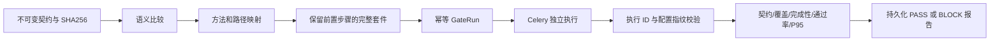

# 契约变更驱动回归与质量门禁

此模块在 TestHub 原有接口管理能力上新增，后端 `apps/contracts`、`apps/quality_gates`，前端 `QualityGate.vue`，CI 客户端 `scripts/quality_gate.py`。开发职责涵盖兼容性规则设计、回归影响分析、执行证据绑定、门禁决策、可视化页面与 CI 验证。平台原有 AI、UI、APP 模块复用上游实现。

## 解决的问题

接口测试全绿仍可能有消费者不兼容问题；全量执行又会覆盖许多无关套件。这里把契约变更作为回归入口，明确回答“变了什么、该测哪些、凭什么放行”。兼容性分析和 HTTP 功能断言独立判定，因此业务断言全绿不能掩盖响应字段类型变化。



## 可复现验证

```bash
docker compose -p testhub-secondary-verify -f docker-compose.verify.yml up --build --detach --wait
python scripts/verify_quality_gate.py --base-url http://127.0.0.1:18080 --password 'TestHubDemo!2026'
```

隔离环境仅使用演示账号与测试凭据，不读取个人 `.env`。初始化两个套件：登录→个人资料、独立健康检查。契约只更改个人资料时选择 1/2 个套件，执行登录和资料两个请求。这是固定演示数据上的选择结果，不代表生产环境提效比例。

验证脚本要求 compatible=PASS、breaking=BLOCK、极低延迟预算=BLOCK，并断言两个请求均执行、HTTP 断言通过率 100%、报告无演示 Token。MySQL/Redis 与容器两个 CI job 均运行此验收，报告以 artifact 保存。

单机演示可用 `python manage.py seed_quality_demo --password 'TestHubDemo!2026'`，默认被测服务 `http://127.0.0.1:8089`。需同时启动 `scripts/demo_api.py`、Daphne、独立 Celery worker，配置参照原交付文档。

## CI 命令行

将账号放入环境变量 `TESTHUB_USERNAME` / `TESTHUB_PASSWORD`，避免把真实密码写入仓库。项目 ID 从项目列表取得。

```bash
python scripts/quality_gate.py --base-url http://127.0.0.1:18080 \
  --project PROJECT_ID --baseline fixtures/contracts/baseline.json \
  --candidate fixtures/contracts/compatible.json --output gate-report.json
```

退出码：0 放行、2 门禁阻断、3 服务或参数错误。`--idempotency-key` 可用于网络重试，同一个 key 对应相同契约和策略；主动启动新回归须使用新 key。超时会评估当前证据并持久化 BLOCK。

## API 与证据

| API | 职责 |
| --- | --- |
| POST /api/v1/contracts/ | 项目权限校验、规范验证、内容摘要去重；导入后只读 |
| POST /api/v1/quality/plan/ | baseline_id、candidate_id → 语义差异与影响范围 |
| POST /api/v1/quality/execute/ | 同上及 policy；必须有 Idempotency-Key；202 返回 GateRun |
| GET /api/v1/quality/{uuid}/run/ | 查询运行状态、已绑定执行记录与计划 |
| POST /api/v1/quality/evaluate/ | 仅接受 run_id；使用服务端绑定证据生成报告 |
| GET /api/v1/gate-reports/ | 当前用户可访问项目的报告 |

GateRun 保存契约版本、SHA256、策略、套件指纹和本次执行 ID。GateReport 保存每条规则的实际值、要求、结果及汇总。不会接受客户端任意指定成功历史作为本次回归证据。重复评估生成新的报告快照，历史不被覆盖。项目 owner 与 member 可访问，其余用户无法读取契约、运行、报告。

## 兼容性与门禁边界

- 支持 OpenAPI 3.0，按请求/响应方向区分枚举和必填字段变化：请求枚举收紧与响应枚举扩大属于破坏性变化。方法删除、字段类型变化、字段删除等阻断。
- format、范围、组合 schema、安全定义、服务器、响应状态新增等无法在当前 profile 中证明兼容，标记 REVIEW 并阻断。暂未实现人工审批放行，须先消除或确认变更并扩展规则。
- 仅支持本地、非递归 JSON 引用；限制文档 1 MB、展开深度 50、节点 30000，禁止 YAML alias 和网络引用；拒绝 OpenAPI 3.1。拒绝并非表示契约本身错误，而是超出本工具支持范围。
- 映射采用方法+路径、路径参数及环境字典变量。服务器路径前缀和动态 URL 当前可能无法自动匹配，会产生缺少覆盖/未解析变量并阻断；不会静默跳过。
- 套件整体选取用于保留前置依赖，不声称最小请求集合。默认通过率 100%，P95 上限 1000ms；P95 使用 nearest-rank，来自本次功能回归的小样本，不是压测结论或生产 SLO。
- 配置指纹在触发和评估时比较，检测持久化漂移；尚无执行期间的完整快照隔离，不能检测“更改后恢复”的瞬时漂移。
- 数据库唯一约束防重复触发。进程若在部分投递后崩溃，DISPATCHING 或 ERROR 会阻断；尚无 outbox 自动恢复，需排查后以新 key 重试。不能宣称 exactly-once 分布式交付。
- 无语义变更时可无执行通过，但仍需运行处于 READY 且证据一致。没有性能样本时指标显示为空。

## 关键设计决策

- 契约分析独立于 HTTP 断言：消费者兼容性问题可能无法由当前业务用例发现，因此功能断言全绿时仍可阻断发布。
- 选择完整套件：登录与变量提取属于后续请求的依赖，保留这些步骤才能获得有效回归证据。
- 未知变化和缺失证据阻断：对无法证明兼容的语义变化、投递未完成和配置漂移给出明确原因，便于定位。
- 决策使用确定性规则：AI 辅助需求分析与用例生成保留在平台原有模块中；门禁结论使用版本、配置指纹与本次执行结果，保证可复现。

## 验收记录

本地全仓回归 460 项通过、3 项跳过；契约和门禁专项测试 56 项通过。契约引擎语句覆盖率 97%，门禁引擎 100%。[GitHub Actions 验收](https://github.com/DUAN-66/testhub-platform/actions/runs/37278693958) 的四组任务均通过；MySQL/Redis 和 Docker 环境分别验证 compatible=PASS、breaking=BLOCK、latency-budget=BLOCK。
