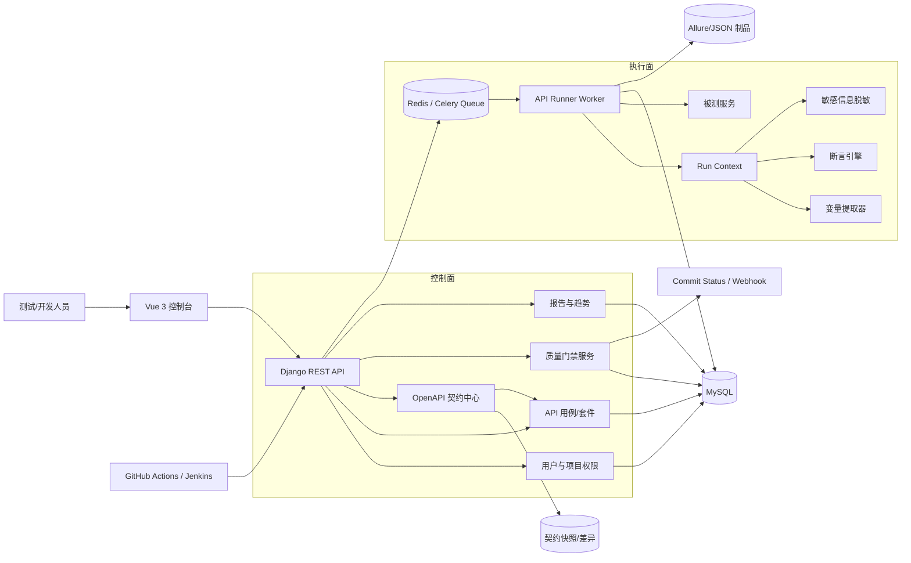
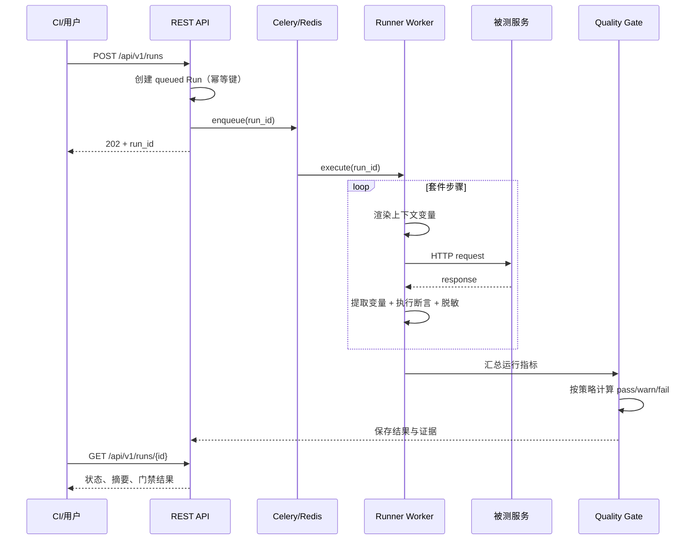

# TestHub QualityGate 目标架构

## 1. 项目定位

项目名称暂定为 **TestHub QualityGate**：基于 TestHub 二次开发的 OpenAPI 驱动接口持续测试与发布质量门禁平台。

重点能力是“契约变更发现 → 受影响用例选择 → 异步执行 → 质量规则判定 → CI 反馈”的闭环，而不是继续堆叠测试类型。

## 2. 逻辑架构



## 3. 后端模块边界

```text
apps/
├── api_testing/                 # 保留资源模型与兼容接口
│   ├── engine/
│   │   ├── context.py           # 套件级变量、Cookie、步骤输出
│   │   ├── request_builder.py   # URL/header/query/body 构造
│   │   ├── extractors.py        # JSONPath/header/regex 提取
│   │   ├── assertions.py        # 状态、Schema、JSONPath、耗时等
│   │   ├── hooks.py             # 受控的前后置扩展点
│   │   ├── runner.py            # 单请求执行
│   │   └── suite_runner.py      # 顺序编排与失败策略
│   ├── services/                # 应用服务和事务边界
│   └── tasks.py                 # Celery 异步入口
├── contracts/                   # 新增：OpenAPI 契约中心
│   ├── importer.py
│   ├── diff.py
│   ├── impact.py
│   └── models.py
└── quality_gates/               # 新增：质量门禁
    ├── evaluator.py
    ├── policies.py
    ├── publishers.py
    └── models.py
```

视图层只负责鉴权、校验与序列化；业务规则放在 service；HTTP 执行只出现在 engine；异步任务只负责调用 service，并使用执行 ID 保证幂等。

## 4. 关键运行时流程



## 5. 非功能约束

- 安全：凭据加密存储；日志、响应与报告统一脱敏；脚本钩子默认关闭或沙箱运行。
- 可靠性：执行任务幂等；worker 可重试；同一执行只能发生合法状态迁移。
- 可观测性：每次执行具备 `run_id`、`trace_id`、耗时、失败阶段和结构化错误码。
- 可扩展性：提取器、断言器、门禁规则采用注册机制，不在视图中增加分支。
- 可测试性：engine 不依赖 Django request，可用纯单元测试覆盖；外部 HTTP 使用 mock/fixture。
- 兼容性：现有 `/api/api-testing/` 在过渡期保留；新增能力统一放到 `/api/v1/`。

## 6. 二开边界

保留 TestHub 的用户、项目、基础 API 资源、报告页面和通知能力。Phase 1 以后只深改 `api_testing`，新增 `contracts` 与 `quality_gates`。其他大型模块仅作为集成方，不在求职项目主线中扩建。

